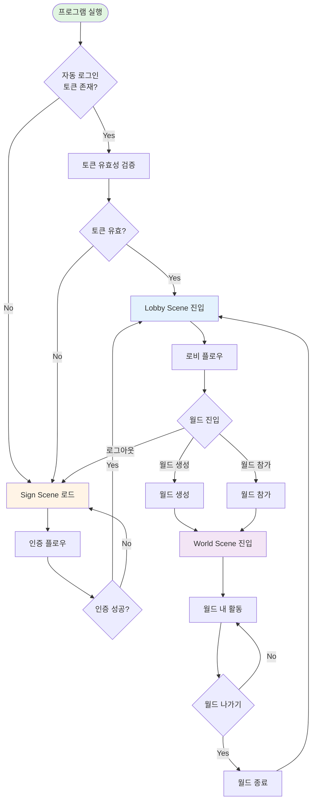

# 사용자 플로우

> **문서 버전**: 1.0
> **최종 수정일**: 26.01.30 13:20
> **작성자**: 임경섭

---

## 1. 개요

이 문서는 VIRDY의 전체 사용자 플로우를 정의한다. 개발자가 앱 흐름을 이해하고, QA가 테스트 케이스를 도출하며, 기획자가 UX를 검증하는 데 활용된다.

### 1.1 Scene 구조

VIRDY는 **인증 → 로비 → 월드** 3단계로 구성되며, 각 단계는 Unity Scene과 1:1 대응된다.

| Scene | Build Index | 역할 | 주요 기능 |
|-------|-------------|------|----------|
| **SIGN** | 0 | 인증 | 로그인, 회원가입, 비밀번호 리셋 |
| **LOBBY** | 1 | 준비 | 아바타/트래커/월드 설정, 월드 생성/참가 |
| **WORLD** | 2 | 실시간 프로덕션 | 모션캡처, 카메라, 방송 송출 |

### 1.2 사용자 역할

| 역할 | 대상 | 권한 |
|------|------|------|
| **Creator** | 크리에이터, 출연자 | 모든 기능 사용 가능 (아바타, 트래커, 월드 생성) |
| **Manager** | PD, 카메라맨, 스태프 | 제한적 기능 (카메라/조명만, 아바타/모션캡처 사용 불가) |

---

## 2. 핵심 플로우

### 2.1 전체 서비스 플로우

---

### 2.2 인증 플로우 (Sign Scene)

#### 2.2.1 로그인

| 단계 | 동작 | 성공 시 | 실패 시 |
|------|------|--------|--------|
| 1 | 이메일/비밀번호 입력 | 다음 단계 | 입력 오류 표시 |
| 2 | Firebase Auth 로그인 API 호출 | 다음 단계 | 오류 표시 (잘못된 비밀번호/계정 없음/네트워크 오류) |
| 3 | 이메일 인증 확인 | 다음 단계 | 경고 + 인증 메일 재발송 옵션 |
| 4 | 자동 로그인 토큰 저장 | 다음 단계 | - |
| 5 | Firestore에서 사용자 정보 로드 | Lobby Scene 전환 | 재시도 또는 로그아웃 |

#### 2.2.2 회원가입

| 단계 | 동작 | 성공 시 | 실패 시 |
|------|------|--------|--------|
| 1 | 이용약관 동의 | 다음 단계 | 로그인 화면으로 |
| 2 | 이메일, 비밀번호, 닉네임 | 다음 단계 | 폼 검증 오류 표시 |
| 3 | Firebase Auth 계정 생성 | 다음 단계 | 이메일 중복/네트워크 오류 |
| 4 | Firestore에 사용자 정보 저장 | 다음 단계 | 계정 삭제 후 로그인 화면으로 |
| 5 | 인증 메일 발송 | 로그인 화면으로 | 경고 표시 (재발송 가능) |

**필수 입력 필드:**
- 이메일 (유효한 형식)
- 비밀번호 (8자 이상, 영문+숫자 조합)
- 닉네임 (필수)

#### 2.2.3 비밀번호 리셋

이메일 입력 → Firebase Auth 비밀번호 리셋 API 호출 → 리셋 메일 발송 완료 → 로그인 화면으로

---

### 2.3 로비 플로우 (Lobby Scene)

#### 2.3.1 Creator 로비 기능

| 기능 | 설명 |
|------|------|
| **액터 설정** | 최대 6개 슬롯, 각 슬롯에 아바타 1개 + 트래커 (Facial/Body/Hand 각 1개) 할당 |
| **아바타 설정** | VRM 업로드/선택, BlendShape 설정, 민감도 조절 |
| **트래커 설정** | Facial/Body/Hand 장비 연결, 캘리브레이션 |
| **월드 설정** | 월드 검색/업로드, 공유 설정 |
| **환경설정** | 그래픽, 사운드, 키바인딩, 언어 |
| **월드 생성** | 월드 생성 플로우 시작 |
| **월드 참가** | 월드 참가 플로우 시작 |
| **로그아웃** | Sign Scene으로 전환 |

#### 2.3.2 Manager 로비 기능

Manager는 아래 기능을 사용할 수 있다:

| 기능 | 설명 |
|------|------|
| **월드 설정** | 월드 검색/업로드, 공유 설정 |
| **환경설정** | 그래픽, 사운드, 키바인딩, 언어 |
| **월드 생성** | 월드 생성 플로우 시작 |
| **월드 참가** | 월드 참가 플로우 시작 |
| **로그아웃** | Sign Scene으로 전환 |

> **Manager 제약:** 아바타/트래커 설정 불가 (카메라/조명 전용 역할)

#### 2.3.3 호스트와 월드 관리

> **용어:** 사용자에게는 "세션"이라는 기술 용어 대신 "월드"와 "호스트"를 사용한다.

**호스트 (Host):**
- 월드를 연 사용자가 해당 월드의 **호스트**가 됨
- 플레이어 목록에서 👑 왕관 아이콘으로 표시
- 호스트가 나가면 남은 유료 사용자에게 자동 이전 (10분 유예 후)

**호스트 이전 시나리오:**

| 상황 | 동작 |
|------|------|
| 호스트 퇴장 (팅김/나감) | 10분 유예 → 유예 내 복귀 시 호스트 유지 |
| 유예 후 미복귀 | 남은 유료 사용자에게 호스트 자동 이전 |
| 호스트가 새 월드 열기 | 기존 월드의 호스트를 다른 유저에게 이전 후 새 월드 생성 |
| 유료 사용자 0명 | 10분 유예 후 월드 자동 종료 |

> **참고:** 호스트 이전 및 월드 생명주기 상세 정책은 [데이터 생명주기](../03_Operations/04_Data_Lifecycle.md) 참조
> **참고:** 활성 월드 관리 UI는 검토 중. [UI 기획](../04_Design/01_UI_Specification.md) 참조

---

### 2.4 월드 진입 플로우

#### 2.4.1 월드 생성

> **개발자 참고:** 내부적으로 Photon Fusion "세션"을 생성하는 플로우이다.

| 단계 | 동작 | 성공 시 | 실패 시 |
|------|------|--------|--------|
| 1 | 구독 플랜 확인 | 다음 단계 | Free 플랜이면 월드 생성 불가 안내 |
| 2 | 월드 선택 확인 | 다음 단계 | "월드를 선택하세요" 경고 |
| 3 | 4자리 랜덤 월드 코드 생성 | 다음 단계 | 중복 시 재생성 |
| 4 | Photon Fusion 세션 생성 | 월드 로딩 시작 | 네트워크/서버 오류 |

> **참고:** Creator/Manager 역할과 무관하게 월드 생성 가능. Free 플랜만 월드 생성 제한.

#### 2.4.2 월드 참가

> **개발자 참고:** 내부적으로 Photon Fusion "세션"에 참가하는 플로우이다.

**참가 방법:**
1. **월드 코드 입력:** 4자리 영숫자 직접 입력
2. **친구 초대 수락:** Chat으로 받은 초대 메시지에서 코드 추출
3. **따라가기:** 친구 목록에서 접속 중인 친구의 월드로 이동

| 단계 | 동작 | 성공 시 | 실패 시 |
|------|------|--------|--------|
| 1 | 월드 코드 입력/추출 | 다음 단계 | 형식 오류 표시 |
| 2 | Photon 세션 검색 | 다음 단계 | "월드를 찾을 수 없습니다" |
| 3 | 월드 인원 확인 | 다음 단계 | "월드가 가득 찼습니다 (100명)" |
| 4 | Photon Fusion 세션 참가 | 월드 로딩 시작 | 네트워크/타임아웃 오류 |

#### 2.4.3 월드 로딩

| 단계 | 표시 메시지 | 동작 |
|------|------------|------|
| 1 | "월드 정보 불러오는 중..." | Firebase Storage에서 메타데이터 다운로드 |
| 2 | "월드 데이터 다운로드 중... (XX%)" | AssetBundle 다운로드 (캐시 확인 후) |
| 3 | "씬 로딩 중..." | Unity Scene 로드 |
| 4 | "월드 접속 중..." | Photon Chat 구독, NetworkGame 초기화 대기 (30초 타임아웃) |

**캐싱:**
- 월드 AssetBundle은 로컬에 캐시 (`Application.persistentDataPath/WorldCache/`)
- 메타데이터의 버전 해시로 유효성 검증
- 캐시 유효 시 다운로드 단계 생략

---

### 2.5 월드 내 활동

#### 2.5.1 Creator 활동

| 기능 | 설명 |
|------|------|
| **모션캡처** | 연결된 트래커로 실시간 아바타 구동 |
| **카메라 조작** | 10채널 카메라 전환/이동/설정 |
| **아바타 이동** | 선택한 액터의 WASD로 아바타 이동 (위치/회전 네트워크 동기화) |
| **채팅** | 전체/팀 채팅 메시지 전송 |
| **방송 출력** | Spout/윈도우 캡처로 OBS 연동 |
| **조명 제어** | Directional Light 강도/방향 조절 |
| **포스트 프로세싱** | Bloom/Color 파라미터 조절 |
| **Channel Link** | 카메라 송출/수신 |
| **초대** | 친구에게 월드 초대 |

#### 2.5.2 Manager 활동

| 기능 | 설명 |
|------|------|
| **카메라 조작** | 10채널 카메라 전환/이동/설정 |
| **Channel Link** | 카메라 송출/수신 (PD 워크플로우) |
| **아바타 이동** | 선택한 액터의 WASD로 아바타 이동 (위치/회전 네트워크 동기화) |
| **조명 제어** | Directional Light 강도/방향 조절 |
| **포스트 프로세싱** | Bloom/Color 파라미터 조절 |
| **채팅** | 전체/팀 채팅 메시지 전송 |

#### 2.5.3 멀티유저 프로덕션 (PD 워크플로우)

대규모 프로덕션에서 다수 Manager가 협업하는 구조:

| 역할 | 동작 |
|------|------|
| **카메라맨 B, C, D** | 각자 CAM 1~3 촬영 → PD의 고정 카메라에 Channel Link |
| **PD (A)** | 모든 카메라맨의 화면 수신 → R+1~9 키로 실시간 스위칭 |
| **Creator** | PD의 Main Screen 수신 → Spout/윈도우 캡처로 방송 송출 |

Creator와 Manager의 조작 차이는 Actor의 존재 유무일뿐, 그외에 시스템적으로 사용을 제한하는 기능은 없다.

---

### 2.6 월드 퇴장

| 단계 | 동작 | 비고 |
|------|------|------|
| 1 | 확인 팝업 표시 | "월드에서 나가시겠습니까?" |
| 2 | Photon Chat 채널 구독 해제 | 실패 시 경고 후 계속 |
| 3 | NetworkRunner 종료 | 5초 타임아웃 후 강제 종료 |
| 4 | 월드 AssetBundle 언로드 | 메모리 해제 |
| 5 | Lobby Scene 로드 | 실패 시 프로그램 재시작 필요 |

---

### 2.7 소셜 기능

#### 2.7.1 친구 추가

| 단계 | 동작 |
|------|------|
| 1 | 친구 검색 UI 열기 |
| 2 | 검색어 입력 (닉네임 또는 이메일, 2자 이상) |
| 3 | Algolia 검색 API 호출 |
| 4 | 검색 결과에서 사용자 선택 |
| 5 | Firebase에 친구 추가 요청 |

#### 2.7.2 친구 초대

월드 접속 중일 때, 온라인 친구에게 Photon Chat으로 초대 메시지 전송 (`/invite {worldCode}`)

#### 2.7.3 따라가기

로비에서 친구 목록 조회 → 월드 접속 중인 친구 선택 → 해당 월드로 자동 참가

---

## 3. 설계 시 고려사항

### 3.1 Scene 전환

| 전환 | 조건 | 정리 작업 |
|------|------|---------|
| SIGN → LOBBY | 인증 성공 | - |
| LOBBY → WORLD | 월드 생성/참가 성공 | - |
| WORLD → LOBBY | 월드 퇴장 | NetworkRunner 종료, AssetBundle 언로드 |
| LOBBY/WORLD → SIGN | 로그아웃 | FusionService 정리 |

### 3.2 자동 로그인

| 항목 | 설명 |
|------|------|
| 저장 위치 | PlayerPrefs 또는 로컬 파일 |
| 유효 기간 | Firebase 기본 설정 (1시간 ~ 7일) |
| 검증 방식 | 프로그램 시작 시 Firebase Auth 토큰 검증 |
| 만료 시 동작 | Sign Scene 로드, 재로그인 요구 |

### 3.3 네트워크 재연결 전략

| 서비스 | 재연결 전략 | 타임아웃 | 실패 시 동작 |
|--------|------------|---------|------------|
| **Photon Fusion** | 자동 재연결 시도 | 30초 | 강제 종료, 로비 복귀 |
| **Photon Chat** | 지수 백오프 (5초 → 60초) | 무제한 | 채팅만 비활성화, 세션 유지 |
| **Firebase** | 즉시 실패, 재시도 없음 | - | 오류 표시, 사용자 재시도 유도 |

### 3.4 역할 기반 UI 제어

| 역할 | 로비 UI | 월드 UI |
|------|---------|---------|
| **Creator** | 액터/아바타/트래커/월드 패널 전체 | 모든 기능 |
| **Manager** | 설정 패널만 | 카메라/조명 제어만 |

### 3.5 캐싱 전략

| 항목 | 설명 |
|------|------|
| 캐시 위치 | `Application.persistentDataPath/WorldCache/` |
| 버전 관리 | 메타데이터의 버전 해시로 유효성 검증 |
| 캐시 삭제 조건 | 버전 불일치, Scene 로드 실패 |
| 최대 캐시 크기 | 5GB (향후 설정 가능) |

---

## 4. 예외 처리

### 4.1 인증 단계

| 상황 | 대응 |
|------|------|
| 이메일 인증 미완료 상태에서 로그인 | 경고 표시, 인증 메일 재발송 옵션 |
| 회원가입 중 네트워크 중단 | 재시도 옵션, 계정 생성 실패 시 Firebase 데이터 롤백 |
| 자동 로그인 토큰 만료 | Sign Scene 로드, 재로그인 요구 |

### 4.2 로비 단계

| 상황 | 대응 |
|------|------|
| Free 플랜에서 월드 생성 시도 | UI에서 버튼 비활성화, 업그레이드 안내 |
| Manager가 아바타/트래커 설정 시도 | UI에서 패널 비활성화, 툴팁으로 제약 안내 |
| 아바타 파일 업로드 실패 | 오류 메시지, 지원 형식 안내 (VRM) |
| 트래커 연결 실패 | 장비별 연결 가이드 표시, 재시도 버튼 |
| 월드 코드 입력 오류 | "월드를 찾을 수 없습니다" 오류 |
| **동시 월드 제한 초과** | 새 월드 열기 차단, 기존 월드 닫기 유도 |
| **호스트가 새 월드 열기 시도** | 기존 월드 닫기 확인 팝업 → 남은 유저에게 호스트 이전 |

### 4.3 월드 진입

| 상황 | 대응 |
|------|------|
| 월드 인원 초과 (100명) | "월드가 가득 찼습니다" 오류, 로비 복귀 |
| 월드 다운로드 중 네트워크 끊김 | 타임아웃 후 재시도 옵션, 실패 시 로비 복귀 |
| AssetBundle 손상 | 캐시 삭제 후 재시도 유도 |
| 초기화 타임아웃 (30초) | 자동 연결 해제, 로비 복귀 |
| 접속한 월드가 삭제된 상태 | "월드가 삭제되었습니다" 오류, 로비 복귀 |

### 4.4 월드 내 활동

| 상황 | 대응 |
|------|------|
| 네트워크 연결 끊김 | 30초 재연결 시도, 실패 시 강제 퇴장 |
| Chat 연결 끊김 | 백그라운드 재연결, 세션은 유지 |
| Channel Link 이중 연결 시도 (A→B→C) | "이중 공유는 불가능합니다" 경고 |
| Creator가 아바타 없이 월드 진입 | 빈 액터 상태로 참가 |

### 4.5 소셜 기능

| 상황 | 대응 |
|------|------|
| 오프라인 친구에게 초대 시도 | "친구가 오프라인 상태입니다" 알림 |
| 친구가 없는 월드로 따라가기 시도 | "친구가 월드에 없습니다" 오류 |
| 검색 결과 없음 | "다른 검색어를 시도하세요" 안내 |

---

## 5. 상태 정의

### 5.1 Scene 상태

| Scene | 상태 | 설명 |
|-------|------|------|
| SIGN | Idle | 로그인 화면 표시 중 |
| SIGN | Authenticating | Firebase Auth API 호출 중 |
| LOBBY | Idle | 로비 화면 표시 중 |
| LOBBY | CreatingSession | 세션 생성 API 호출 중 |
| LOBBY | JoiningSession | 세션 참가 API 호출 중 |
| WORLD | Loading | 월드 로딩 중 |
| WORLD | Active | 월드 활동 중 |
| WORLD | Disconnecting | 세션 종료 처리 중 |

### 5.2 네트워크 상태

| 상태 | 설명 |
|------|------|
| Disconnected | 세션 연결 안 됨 (로비에서 모든 기능 사용 가능) |
| Connecting | 세션 연결 시도 중 (로딩 화면) |
| Connected | 세션 연결됨 (월드 활동 가능) |
| Reconnecting | 재연결 시도 중 (제한적 활동) |
| Failed | 연결 실패 (로비로 강제 복귀) |

---

## 6. 향후 확장 가능성

| 항목 | 현재 | 향후 | 우선순위 |
|------|------|------|---------|
| **소셜 로그인** | 이메일/비밀번호만 | Google, Steam, Discord | 높음 |
| **런처** | 없음 | 자동 업데이트 + 토큰 인증 | 높음 |
| **로컬 모드** | 미지원 | 네트워크 없이 단독 사용 | 중간 |
| **튜토리얼** | 없음 | 최초 실행 시 온보딩 가이드 | 중간 |
| **음성 채팅** | 미지원 | 월드 내 실시간 음성 | 낮음 |
| **월드 녹화** | 미지원 | 모션 데이터 녹화 및 재생 | 장기 |

---

## 7. 관련 문서

- [제품 개요](./01_Product_Overview.md)
- [사용자 역할](../03_Operations/01_User_Roles.md)
- [아바타 시스템](../02_Features/01_Avatar_System.md)
- [트래커 시스템](../02_Features/02_Tracker_System.md)
- [카메라 시스템](../02_Features/03_Camera_System.md)
- [월드 시스템](../02_Features/04_World_System.md)
- [네트워크 시스템](../02_Features/05_Network_System.md)
- [라이선스 체계](../03_Operations/02_License_System.md)
- [UI 기획](../04_Design/01_UI_Specification.md)

